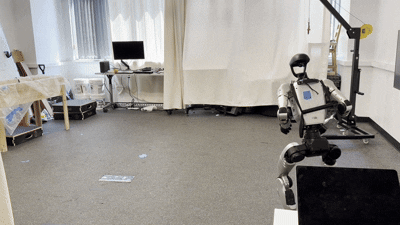
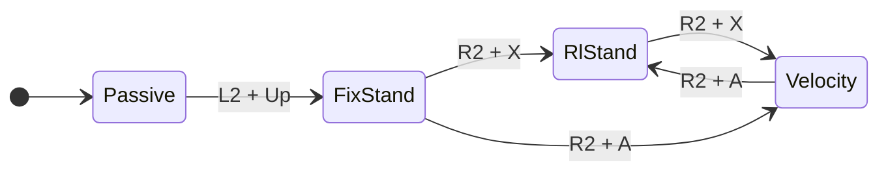

# smp_deploy

Deployment side of [SMP](https://github.com/SUZ-tsinghua/smp).




## Install

Ubuntu:

```bash
git clone https://github.com/psrobotics/smp_deploy && cd smp_deploy
scripts/setup_ubuntu.sh --install
```

Run it without `--install` first if you want to see what it's going to do. It
covers the apt packages, uv, unitree_sdk2 with CycloneDDS, MuJoCo, ONNX Runtime,
and pulls the policy files through git-lfs.

## State machine

The controller only changes state on joystick chords. All of it is declared in
`deploy/robots/g1/config/config.yaml`.


| State | |
|---|---|
| `Passive` | Damping only|
| `FixStand` | PDstand |
| `RlStand` | Standing policy. Holds the pose, rejects pushes. |
| `Velocity` | SMP locomotion. |

`B` drops to `Passive` from any state.


## Sim2sim

```bash
scripts/sim2sim.sh              # Joystick plugged in
scripts/sim2sim.sh --auto       # --scripted, and drives the FSM for you
```

Simulate starts in Passive -> (L2 + Up) -> FixStand -> (R2 + X) -> RlStand -> (R2 + X) -> Velocity. Then you can joystick robot around.

**Elastic band.** Use arrow keys and 9 to release the robot from hanging at RLstand mode. 

## Sim2real


1. Hang the robot and power it on. Enter develop mode.
2. SSH to the robot. Set your machine to `192.168.123.222` /
   `255.255.255.0` and get the interface name from `ifconfig`.
3. Build and run:

```bash
cd deploy/robots/g1
cmake -S . -B build -DCMAKE_BUILD_TYPE=Release && cmake --build build -j
./build/g1_ctrl --network=enp5s0
```
4. Release the robot at RLStand mode.

## Running your own policy

Export to ONNX with an `obs` input and an `actions` output, put it and its YAML
under `deploy/robots/g1/config/policy/`, and point an FSM state at them in
`config.yaml`. The runtime builds the observation vector from the YAML.


## Layout

```
deploy/       Controller: FSM, C++ runtime, the policies
sim/          Unitree MuJoCo
lcm_types/    LCM messages
scripts/      Setup, contract check, sim2sim launcher
```

## License

Apache-2.0. `deploy/` comes from unitree_rl_mjlab (Apache-2.0, itself derived
from Isaac Lab) and `sim/` from unitree_mujoco (BSD-3-Clause).

## Acknowledgements
- MDP from [SMP](https://github.com/SUZ-tsinghua/smp), trained on [mjlab](https://github.com/mujocolab/mjlab) / [rsl_rl](https://github.com/leggedrobotics/rsl_rl), reproducing [Mu et al., 2025](https://arxiv.org/abs/2512.03028) ([MimicKit](https://github.com/xbpeng/MimicKit))
- [unitree_rl_mjlab](https://github.com/unitreerobotics/unitree_rl_mjlab), the deployment controller this is carved out of
- [unitree_mujoco](https://github.com/unitreerobotics/unitree_mujoco), the simulator and its SDK bridge
- [unitree_sdk2](https://github.com/unitreerobotics/unitree_sdk2), [Cyclone DDS](https://github.com/eclipse-cyclonedds/cyclonedds), [LCM](https://github.com/lcm-proj/lcm), [ONNX Runtime](https://github.com/microsoft/onnxruntime), [MuJoCo](https://github.com/google-deepmind/mujoco)
